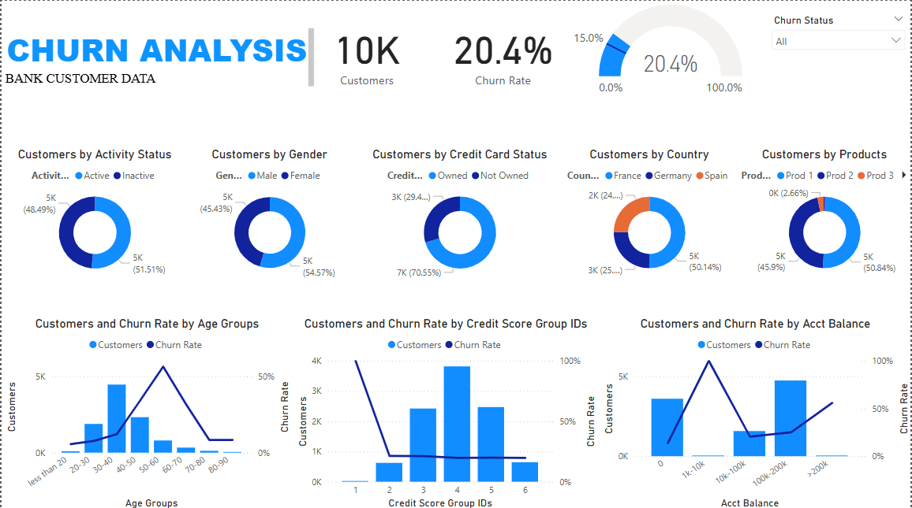

# 📊 Customer Churn Analysis Dashboard – Power BI

This project presents a **Customer Churn Analysis Dashboard** built using **Power BI**. This dashboard analyzes banking customer data to uncover churn patterns, helping stakeholders make informed, data-driven decisions to retain customers and improve business strategies.

---

## 📚 Table of Contents
- [Objective](#-objective)
- [Dashboard Preview](#-dashboard-preview)
- [Key Insights](#-key-insights-covered)
- [Tools & Technologies](#-tools--technologies)
- [Repository Structure](#-repository-structure)
- [How to Use](#-how-to-use)
- [Contact](#-contact)
- [LICENSE](#-license)
---

## 🧠 Objective

The primary objective of this dashboard is to:

- Visualize key metrics related to **customer churn**
- Identify factors influencing churn, such as age, account balance, credit card ownership, etc.
- Help decision-makers understand customer behavior and take proactive actions

---

## 📸 Dashboard Preview



---

## 🔍 Key Insights Covered

- **Total Customers**: 10,000  
- **Churn Rate**: 20.4%

### Breakdown Visualizations:
- Churn by **Activity Status**
- Churn by **Gender**
- Churn by **Credit Card Ownership**
- Churn by **Country**
- Churn by **Product**
- Churn by **Age Group**
- Churn by **Credit Score Group**
- Churn by **Account Balance Group**

---

## 🛠 Tools & Technologies

- **Power BI** (Data Modeling, DAX, Visualizations)
- **Excel / CSV** (Data Source)
- **GitHub** (Version Control and Hosting)

---

## 📁 Repository Structure

📦 Customer-Churn-Dashboard  
┣ 📷 customer_churn_dashboard.png  
┣ 📄 README.md  
┗ 📄 LICENSE  

---

## 🚀 How to Use

1. Clone the repository:
   ```bash
   git clone https://github.com/your-username/customer-churn-dashboard.git

2. Open the .pbix file in Power BI Desktop.
3. Explore the visuals and interact with slicers/filters to uncover insights

---

## 📬 Contact

If you have any suggestions or queries:

- 💼 LinkedIn: https://www.linkedin.com/in/agrawal-prarthana/
- 📧 Email: agrawalprarthana75@gmail.com

---

## 📄 License

This project is licensed under the [MIT License](LICENSE).
